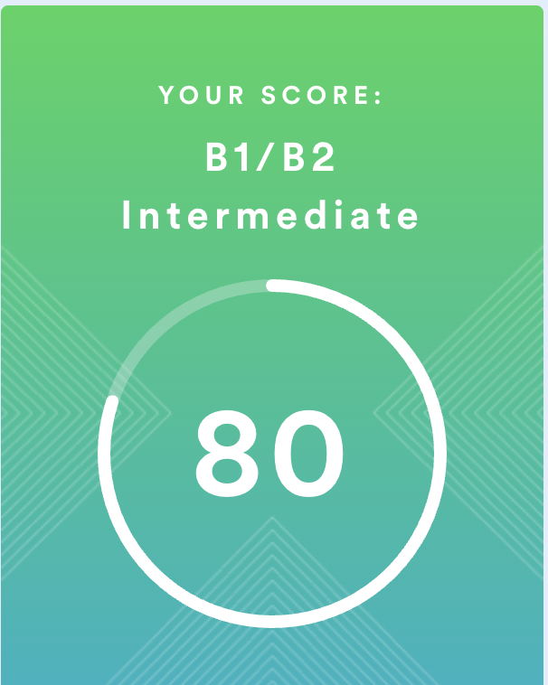

# Ustalkova Vitalina
### Junior Frontend Developer

### Contact information: 
**email:** vita.ustalkova@bk.ru

**discord:** @ta_lina

### Briefly About Myself:
I am eager to learn new and in-demand programming skills in JavaScript and become a skilled professional, working on exciting projects with equally inspiring and motivated people. My strengths are creativity, improvisation, and strong soft skills. Also I love interesting stories. 
### Skills and Proficiency:
* JavaScript Basics
* Git, GitHub
* VS Code
### Code Examples
```
function multiply(a, b){
  return a * b;
}
```
### Education & Training:
* Nizhny Novgorod State Technical University

  *Bachelor studies (3 years) - Major in Information Systems and Technologies*
* RS School - JS / Front-end Course (Stage 1)

  *In progress*
### Languages: 
* Russian - Native
* English - Intermediate (according to the online test at www.egset.org)

